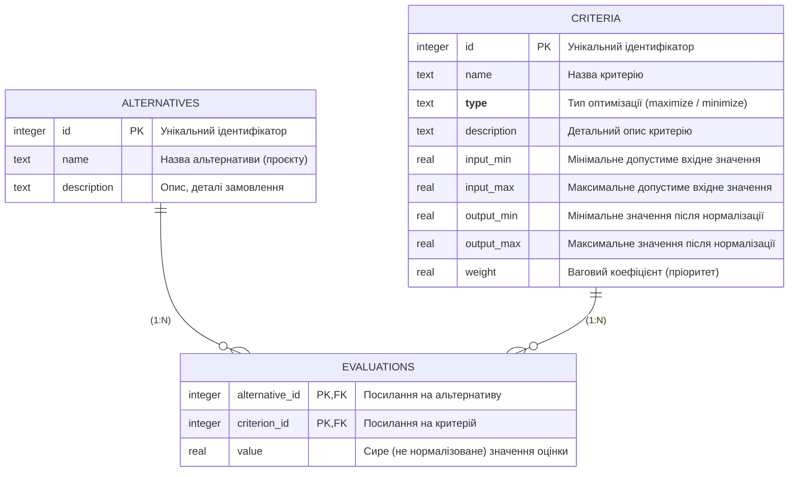

Державний вищий навчальний заклад  
Ужгородський національний університет  
Факультет інформаційних технологій  
Кафедра програмного забезпечення систем

# ЗВІТ ДО МОДУЛЬНОЇ КОНТРОЛЬНОЇ РОБОТИ
## Проектування баз даних та експертних систем
### Тема: Розробка та реалізація системи підтримки прийняття рішень

Виконав:  
студент ІІІ курсу  
спеціальності 121 «Інженерія програмного забезпечення»  
групи ІПЗ-3  
Решко Андрій Людвигович

Ужгород 2026

---

## 1. Мета роботи

Метою роботи є розробка повноцінного програмного продукту, який реалізує систему підтримки прийняття рішень (СППР) для обраної предметної області. Розроблена система повинна не лише структурувати дані (альтернативи, критерії, оцінки), але й містити аналітичний ядро для обчислення результатів, підтримувати кілька методів згортки, ранжувати альтернативи та надавати пояснення щодо отриманого результату.

---

## 2. Предметна область та формалізація задачі

### 2.1. Домен: Вибір замовлень на біржі Upwork
Предметна область охоплює сферу IT-аутсорсингу, де користувачем системи є Lead Generation Specialist. Задача є напівструктурованою: постійно з'являються нові замовлення (альтернативи), які оцінюються за низкою об'єктивних (ставка, час публікації) та суб'єктивних (відповідність експертизі) критеріїв. 

У висококонкурентному середовищі успішність біддінгу залежить від швидкості реакції та правильного вибору лідів. Використання DSS для цієї задачі є життєво необхідним, адже вручну аналізувати десятки замовлень за 10+ параметрами щогодини неможливо.

### 2.2. Формалізація задачі
Система працює з класичною багатокритеріальною моделлю:
- **Множина альтернатив ($A$):** $A = \{A_1, A_2, ..., A_n\}$, де кожна $A_i$ – це конкретний фриланс-проєкт або замовлення на платформі.
- **Множина критеріїв ($C$):** $C = \{C_1, C_2, ..., C_m\}$, де $C_j$ – це параметр оцінки (наприклад, "Час публікації", "Ставка"). Кожен критерій має свій тип (вектор оптимізації): $maximize$ (чим більше, тим краще) або $minimize$ (чим менше, тим краще), а також вагу $W_j$.
- **Матриця оцінювання ($X$):** $X = ||x_{ij}||$, де $x_{ij}$ – сира (фактична) оцінка $i$-тої альтернативи за $j$-тим критерієм. 

_PS: Матриця оцінювання була реалізована не у виді оцінок, а у виді сирих даних, які потім нормалізуються в аналітичному блоці._

---

## 3. Архітектура системи

Додаток розроблено мовою **Go (Golang)** з використанням архітектури, що базується на розділенні відповідальності (Hexagonal Architecture):
- **Presentation / HTTP Layer (`internal/http` та `templates/`):** Відповідає за обробку запитів від користувача, роутинг (фреймворк Gin) та рендеринг HTML-інтерфейсу. Контролери (Handlers) ізольовані від бізнес-логіки.
- **Domain Layer (`internal/domain/entities` та `internal/domain/analytics`):** Містить ядро системи – моделі даних (Alternative, Criterion, Evaluation) та бізнес-логіку нормалізації. Тут також знаходиться ключовий компонент СППР – **ScoringService**, який реалізує паттерн Strategy для методів згортки.
- **Infrastructure / Data Layer (`internal/repositories` та `internal/persistence`):** Відповідає за роботу з базою даних SQLite. Використовуються інтерфейси репозиторіїв, що робить систему легко розширюваною.

Для аналітичного блоку реалізовано інтерфейс `ScoringStrategy`, який дозволяє легко додавати нові методи обчислення оцінки без зміни існуючого коду (GOF Strategy).

Такий підхід забезпечує хорошу читабельність коду та дозволяє легко додавати нові методи обчислення або замінювати БД без втручання в інші модулі.

---

## 4. Реалізація роботи з даними

Для збереження даних використовується реляційна база **SQLite** (`dss.db`).
- **Альтернативи:** Зберігають базову інформацію (ID, Назва, Опис).
- **Критерії:** Зберігають назву, опис, тип (maximize/minimize), а також межі для входу (`InputMin`, `InputMax`) та виходу (`OutputMin`, `OutputMax`) для проведення процедури лінійної нормалізації. Кожному критерію призначається вага.
- **Оцінки:** Зберігаються у зв'язковій таблиці (AlternativeID, CriterionID, Value).

Збереження та отримання реалізовано коректно через SQL-запити з підтримкою bulk-операцій (Upsert) для зручного збереження всієї матриці оцінювання за один запит.

Розширена схема бази даних, що описує структуру збереження даних:

---

## 5. Інтерфейс та API

Система надає зручний веб-інтерфейс (Server-Side Rendering на базі HTML-шаблонів):
- **Головна сторінка:** Відображає зведену матрицю оцінювання. Надає можливість швидкого вводу оцінок у вигляді таблиці, що значно пришвидшує роботу лідгена.
- **Управління сутностями:** Окремі сторінки для створення, редагування та видалення альтернатив і критеріїв.
- **Сторінка результатів (`/ranking`):** Окремий розділ для запуску аналітичного блоку та виведення результатів з можливістю перемикання стратегій "на льоту".

---

## 6. Аналітичний блок та СППР

Аналітичний блок є "мозком" системи. Він виконує наступні кроки:
1. **Нормалізація:** Всі сирі оцінки $x_{ij}$ проходять через метод `Normalize()`, який перетворює їх у діапазон [0, 1] з урахуванням типу критерію (наприклад, для `minimize` менше значення стає ближчим до 1).
2. **Застосування ваг:** Враховується вектор ваг $W$.
3. **Обчислення інтегральної оцінки:** Інтерфейс `ScoringStrategy` дозволяє обирати метод згортки. 

**Реалізовано три стратегії (Бонус за кілька методів згортки):**
- **Адитивна згортка (WADD):** $Q(A_i) = \sum (W_j \times X_{ij})$. Дозволяє недолікам за одними критеріями компенсуватися перевагами за іншими. Найкраще підходить для збалансованих рішень.
- **Мультиплікативна згортка (WPM):** $Q(A_i) = \prod (X_{ij}^{W_j})$. Жорстка стратегія, де нульове значення хоча б за одним критерієм зводить загальну оцінку до нуля. Підходить для критичних проєктів.
- **Обережна стратегія (Minimax / Cautious):** $Q(A_i) = \min(W_j \times X_{ij})$. Вибирається альтернатива з найкращим "найгіршим" результатом для мінімізації ризиків.

Користувач може динамічно змінювати стратегію безпосередньо на сторінці результатів через dropdown-меню, що перераховує рейтинг у реальному часі.

Детальне пояснення кожного методу згортки та їх впливу:

### 1. Адитивна згортка (WADD - Weighted Additive)

**Суть:** Підсумовування зважених нормалізованих значень критеріїв.

**Переваги:**
- Компенсація – низький бал за одним критерієм компенсується високим за іншим
- Прозорість легко пояснити результат
- Простота реалізації та інтерпретації

**Недоліки:**
- Чутлива до викидів
- Вимагає нормалізації критеріїв
  
**Use cases:**

1. **Довгосрочні контракти**
    - Фрилансер може зробити знижку постійному клієнту
    - Негативні відгуки можуть бути компенсовані хорошою оплатою в майбутньому
    - Висока тривалість проєкту окупає початкові ризики

2. **Пошук нових клієнтів**
    - Низька ставка може компенсуватися великим обсягом роботи
    - Висока конкуренція – але єдиний спосіб побудувати портфоліо

3. **Різнопланові проєкти**
    - Коли критерії мають різну природу (ціна, якість, ризик)
    - Потрібна збалансована оцінка

---

### 2. Мультиплікативна згортка (WPM - Weighted Product Model)

**Суть:** Перемноження значень критеріїв у степені ваг.

**Переваги:**
- Строга компенсація: неможливо "перекрити" нульове значення
- Підходить для критеріїв з пороговими обмеженнями

**Недоліки:**
- Якщо хоча б один критерій = 0, весь результат = 0
- Складніша інтерпретація
- Не інтуїтивна для користувачів

**Use cases:**

1. **Критичні проєкти**
    - Де є табу (наприклад, є негативні відгуки – привід відмовити)
    - Будь-який серйозний недолік – привід відмовити

2. **Відносини з новими клієнтами**
    - Потрібно перевірити всі критерії, перш ніж починати

3. **Ексклюзивні проєкти**
    - Де якість важливіша за ціну
---

### 3. Обережна стратегія (Minimax / Pessimistic)
**Суть:** Вибирається альтернатива з найкращим "найгіршим" результатом.

**Переваги:**
- Мінімізує ризик: гарантує мінімальний рівень за всіма критеріями
- Підходить для критичних рішень

**Недоліки:**
- Демотивує: не заохочує "видатні" результати
- Консервативна, не враховує переваги

**Use cases:**

1. **Для безпечно-критичних проєктів**
    - Робота з ентерпрайз клієнтами.
    - Де один провал == катастрофа

2. **Перший контракт з клієнтом**
    - Мінімізує ризики поки немає історії

3. **Обмежений бюджет**
    - Не можна дозволити собі жодного серйозного недоліку

---

## 7. Результат роботи та пояснення рішення

### Система чітко формує ранжований список
На сторінці результатів альтернативи відсортовані за спаданням оцінки (від найкращої до найгіршої альтернативи).

### Для наочності розраховується RelativeScore
Це відносна оцінка порівняно з лідером, яка відображається у вигляді візуального Progress Bar (елемент візуалізації результатів).

### Пояснення логіки
Під кожною альтернативою розгорнуто виводиться деталізація – який внесок у загальну оцінку зробив кожен окремий критерій. Це відповідає на питання "Чому саме ця альтернатива перемогла?" і дозволяє спеціалісту переконатися у логічності отриманого рішення.

---

## 8. Висновки

Розроблений програмний продукт є повністю функціональною Системою Підтримки Прийняття Рішень, яка:
1. Вирішує реальну та актуальну задачу вибору проєктів на Upwork.
2. Має гнучку архітектуру, яка дозволила легко імплементувати складну логіку.
3. Дозволяє зручно управляти матрицею даних.
4. Успішно застосовує математичні методи (3 види згортки) для знаходження оптимального рішення.
5. Надає візуалізоване пояснення згенерованого результату.

Система задовольняє всі вимоги, поставлені до проєкту, включаючи бонусні критерії (реалізація кількох методів згортки).

